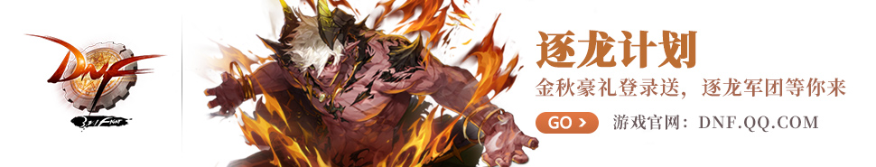

10天完成和平精英官方网站的首页静态页面（html+css）
# 项目准备
新建html和两个css文件，一个嵌套另一个用于模块化管理
index.css设置样式，public.css设置公用样式      
[和平精英官网](https://gp.qq.com/main.shtml)
# 头部
## 通栏
- 通栏左部
在header里面新建div盒container类，内置左右两部分
左边是和平精英logo（img），点击会用新窗口打开一个新的页面（超链接）                
logo右面有一个小图片，鼠标悬浮在上面的时候他会放大显示，不掩盖小图片（设置层级）,并且有超链接      
```
        <div class="container">
            <div class="left">
                <a href="#" target="_blank"></a>
                <span>
                    
                    <a href="#" target="_blank"></a>
                </span>
            </div>
```
通栏左边的大图左边对齐left左边说明是相对左边定位的,       
绝对定位不占据空间所以可以覆盖其他元素，将大图设置相对定位         
腾讯游戏logo不能被遮盖所以设置logo的层级数字要大于大图的      
设置层级使其悬浮于上。display：none最初不展示     
将span大图悬浮设置块级显示，    
 display: block;
    /* 块级元素独占一行可以设置宽高 */
```
#top .left{
    position: relative;
}
#top .logo{
    margin: 0 20px;
    position: relative;
    z-index: 4;
}
#top .left span a{
    position: absolute;
    /* 绝对定位本身不占据空间，所以可以覆盖其他框 */
    left: 0;
    top: 0;
    z-index: 3;
    /* 数字大的会遮盖数字小的，所以logo会遮住大图 */

    padding: 0 3px 3px; /* 上边 | 左边右边 | 下边 */
    border-bottom: 1px solid #eee;
    background: #fff;

    display: none;  /* 最初不展示 */
}
#top .left span:hover a{
    display: block;
    /* 块级元素独占一行可以设置宽高 */
}
```

- 通栏右部
一个ico图标，成长守护平台(a)，和一个腾讯游戏排行榜iframe     
```
            <div class="right">
                <h3 class="text1"><a href="#" target="_blank">成长守护平台</a></h3>
                <h3 class="text2">
                    <span>腾讯游戏排行榜</span>
                    <iframe src="https://game.gtimg.cn/images/js/title/title_game_rank.html?rd=0.5079157561030598" frameborder="0"></iframe>
                </h3>
            </div>
```
样式：     
设置弹性盒布局    
文字并排有间隙，取消加粗，拓展文字区域内边距插入精灵图    
伪元素设置腾讯游戏排行榜，设置content：''和宽度高度，行内元素需要固定内容才可以设置宽高          
雪碧图设置成伪元素的背景，左右布局相似，方向略有不同，箭头旋转方向使用transform       
iframe设置原始状态不显示，设置足够宽高使滚动条消失，使其脱离文档流（设置绝对定位）     
```
 #top .right{
    position: relative;
    display: flex;
 }
 #top .right h3{
    color: #464646;
    font-size: 14px;
    line-height: 40px;
    /* 行高和父级top高度相同 */
    /* 如果行高的值与容器的高度相等，那么文字垂直居中*/
    font-weight: normal;/* 取消加粗 */

    position: relative;/* icon需要绝对定位，所以父级相对定位 */
    
 }
 #top .right h3 a{
    color: #464646;  
    /* 颜色正常显示黑色 */
 }
 #top .right h3 a:hover{
    color: #ff4e00;
    /* 鼠标浮在上面的时候显示红色 */
 }
#top h3.text1{
     margin-right: 20px;/*外边距设置两短语之间的距离 */

    /* 成长守护平台占据了h3标签的宽度，如果插入icon需要空间内边距拓展 */
    padding-left: 30px;
}
 #top h3.text1::after{ /*after和before都可以，伪元素设置图标*/
    content: '';
    /* 行内元素需要固定内容才可以设置宽高 */
    width: 30px;
    height: 30px;
    background: url(../imgs/title_sprite.png) -30px 0;/* 这两个数字是x轴y轴距离*/
    /* 此时雪碧图无显示，因为content行内元素，宽高是撑不起的，需要固定定位 */
    position: absolute;
    left: 0;
    top: 5px;
    
}
#top h3.text2{
    padding-right: 30px;/*内边距拓展右边空间放置雪碧图 */

   /* 成长守护平台占据了h3标签的宽度，如果插入icon需要空间内边距拓展 */
   cursor: pointer; /*鼠标悬停变成手*/
}
#top h3.text2::after{ /*after和before都可以，伪元素设置图标*/
   content: '';
   /* 行内元素需要固定内容才可以设置宽高 */
   width: 30px;
   height: 30px;
   background: url(../imgs/title_sprite.png);
   /* 此时雪碧图无显示，因为content行内元素，宽高是撑不起的，需要固定定位 */
   position: absolute;
   right: 3px;
   top: 5px;

    opacity: .1;/*设置透明度 */
    transform: rotate(90deg);/*箭头旋转向下*/
   
}
#top .right iframe{
    display: none;
    /* 原始状态不显示 */
    width: 708px;
    height: 582px;
    /* 设置足够宽高则滚动条消失，但是占据文档流空间，挤了其他的元素 */

    position: absolute;
    /* 绝对定位不占据文档流了 */
    right: 0;
    top: 40px;
 }

 /* 鼠标经过显示 */
#top h3.text2:hover iframe{
   display: block;
}
```
- 通栏整体
整体设置弹性盒模型，方便调整位置（官网使用的是浮动）   
设置宽度，margin: 0  auto;/*内容水平居中 */        
外边距上下为0，左右自适应

```
#top{
     height: 40px; /* 白色部分通栏高度 */
    background: #fff;
    border-bottom: 1px solid #f5f5f5;
}
```

```
#top .container{
    width: 980px;
    margin: 0  auto;/*内容水平居中 */

    display: flex;/* 弹性盒模型 */
    justify-content: space-between; /* 两端对齐 */
}

```
# 导航
## 导航条

**布局技巧**          
**不能让左中右成为整体然后居中**导航条的左中部分是整体居中的,右部分绝对定位脱离文档流放在中间的右边,相对于父级向右移动就好(所以login右部分的父级使用相对定位)/* nav1是导航条 */
```
<div id="nav">
        <div class="nav1">
            <div class="title">
                <a href="#" target="_blank"></a>
                <h1>和平精英<span>全球玩家的冒险竞技世界</span></h1>
            </div>
            <ul>
                <li><a href=""target="_blank">版本专区</a></li>
                <li><a href=""target="_blank">游戏资料</a></li>
                <li><a href=""target="_blank">赛事专区</a></li>
                <li><a href=""target="_blank">安全中心</a></li>
                <li><a href=""target="_blank">自助工具</a></li>
                <li><a href=""target="_blank">社区论坛</a></li>
                <li><a href=""target="_blank">下载游戏</a></li>
                <li>
                    <a href="https://gp.qq.com/web201908/search.html" >
                        
                    </a>
                </li>
            </ul>
            <div class="login">
                <span></span>
                <p>特种兵，请<span>登录</span></p>
            </div>
        </div>
    </div>
```
导航条及其悬浮菜单的整体容器nav       
nav1导航条部分有背景设置高度,nav1的内容一行展示,使用弹性盒模型
```
/* nav1是导航条 */
#nav{
    height: 134px;
    background: url(../imgs/bg-nav.png) center no-repeat;    
}
#nav .nav1{
    /* login部分绝对定位脱离文档流父级使用相对定位 */
    position: relative;
    /* 固定宽度 */
    width: 1200px;
    /* 居中 */
    margin: 0 auto;
    /* 内容一行展示使用弹性盒模型 */
    display: flex;
}


```
根据内容划分板块     
- 左-标题部分
*快捷操作div.title*
图片放在a标签里;和平精英用权重最高的h1标签;小的字也是标题一部分但是显示不同样式所以在h1中嵌套span;新版本的图片就使用伪类；

```
 <div class="title">
                <a href="#" target="_blank"></a>
                <h1>和平精英<span>全球玩家的冒险竞技世界</span></h1>
            </div>

```

```
#nav .nav1 .title{
   /* 图片文字一行展示使用弹性盒模型 */
   display: flex;
   /* 距离右侧边距40px */
   margin-right: 40px;
}
#nav .nav1 .title a{
   margin: 6px 20px 0 0;
}
/* 减少嵌套层数小幅度优化性能 */
#nav .nav1 h1{
font-size: 24px;
color: #ffb400;
margin-top: 28px;
/* 新版本图片使用伪类定位,父级需要相对定位 */
position: relative;
}
#nav .nav1 h1 span{
   font-size: 14px;
   color: #fff;
   /* span行内元素,变成块级元素让它独占一行 */
   display: block;
   /* 取消加粗 */
   font-weight: normal;
   margin-top: 2px;
}
/* 通过伪类实现新版本图标 */
#nav .nav1 h1::after{
   content: '';
   width: 69px;
   height: 19px;
   /* 绝对定位脱离文档流 */
   position: absolute;
}


```
- 中-菜单部分
*快捷操作* ul>li*7>a     
最后一个搜索符号有实际功能所以不使用伪类实现直接在html通过a嵌套img实现
```
(html已经在上面展示这里不再重复)
#nav .nav1 ul{
   display: flex;
}
#nav .nav1 li a{
   /* 每个目录不是单纯文字他的区域是一块,其中包括文字,可以通过浏览器控制台查看 */
   display: block;
   width: 102px;
   /* 如果行高的值与容器的高度相等，那么文字垂直居中。 */
   height: 102px;
   line-height: 102px;

   font-size: 16px;
   color: #fff;
   /* 文字水平居中 */
   text-align: center;
}
#nav .nav1 li a:hover{
   color:#ffb400;
}

```

 - 右-登录区域
 图标文字弹性布局纵向排布      
 内容设置水平居中
```
#nav .nav1 .login{
   width: 126px;
   height: 100px;
   /* nav1相对定位login的定位依托于nav1,
   同时绝对定位脱离文档流不占据空间title小字就不换行了 */
   position: absolute;
   top:0;
   right: -120px;

   /* 文字和icon弹性盒 */
   display: flex;
   /* 子元素纵向排布 */
   flex-direction: column;
   /* 水平垂直居中 */
   justify-content: center;
   align-items: center;
}
```
  
  
## 导航下拉悬浮菜单

内容纵向分布，有的文字目录前面有N,H红色小图标，最后一列布局具有二维码交互功能(不用伪类)   这部分命名类为nav2    
布局技巧   
菜单中的菜单可以使用ul>li双重嵌套，即ul>li>ul>Li的嵌套（每一列放在一个li标签里面，每一列中的每一个又在一个li当中）      
有红色标签的可以添加class类进行统一管理，H图标设置为hot类，N设置为new类       
最后一列给每个li元素的共同父级添加class类contact       
```
       <div class="nav2">
            <ul>
                <li>
                    <ul>
                        <li class="new"><a href="#" target="_blank">最新版本</a></li>
                        <li class="new"><a href="#" target="_blank">最新赛季</a></li>
                        <li><a href="#" target="_blank">版本中心</a></li>
                        <li><a href="#" target="_blank">体验服</a></li>
                        <li class="new"><a href="#" target="_blank">绿洲启元</a></li>
                    </ul>
                </li>
                <li>
                    <ul>
                        <li><a href="#" target="_blank">新闻资讯</a></li>
                        <li><a href="#" target="_blank">攻略中心</a></li>
                        <li><a href="#" target="_blank">视频中心</a></li>
                        <li class="hot"><a href="#" target="_blank">武器库</a></li>
                        <li class="hot"><a href="#" target="_blank">大神灵敏度</a>
                        <li><a href="#" target="_blank">角色动画</a></li>
                    </ul>
                </li>
                <li>
                    <ul>
                        <li class="hot"><a href="#" target="_blank">赛事中心</a></li>
                        <li><a href="#" target="_blank">全民赛场</a></li>
                        <li class="hot"><a href="#" target="_blank">全国大赛</a></li>
                        <li ><a href="#" target="_blank">巅峰赛</a></li>
                        <li ><a href="#" target="_blank">授权赛</a></li>
                        <li ><a href="#" target="_blank">高校赛事联盟</a></li>
                    </ul>
                </li>
                <li>
                    <ul>
                        <li class="hot"><a href="#" target="_blank">安全反外挂站</a></li>
                        <li><a href="#" target="_blank">视频巡查</a></li>
                        <li><a href="#" target="_blank">成长守护平台</a></li>
                        <li><a href="#" target="_blank">腾讯游戏防沉迷</a></li>
                    </ul>
                </li>
                <li>
                    <ul>
                        <li><a href="#" target="_blank">CDK兑换</a></li>
                        <li><a href="#" target="_blank">客服专区</a></li>
                        <li class="hot"><a href="#" target="_blank">举报查询</a></li>
                        <li><a href="#" target="_blank">作者入驻</a></li>
                    </ul>
                </li>
                <li>
                    <ul class="contact">
                        <li>
                            <a href="javascript:;">官方公众号</a>
                            <span></span>
                        </li>
                        <li>
                            <a href="javascript:;">微信用户社区</a>
                            <span></span>
                        </li>
                        <li>
                            <a href="javascript:;">QQ用户社区</a>
                            <span></span>
                        </li>
                        <li>
                            <a href="javascript:;">官方微博</a>
                            <span></span>
                        </li>
                    </ul>
                </li>
            </ul>
        </div>
```

     
样式效果要nav2遮盖nav1，需要给nav1，nav2设置层级，数字大的遮盖数字小的。      
文字设置居中后位置呈现在logo的位置并且顶着最上面使用margin-top,看上去整体并不居中,使用margin-left无效(如果使用多个方向的margin,可以归并到一个margin中设置不同的数值)          
文字整体左侧显示,margin-left无效可以考虑内边距padding-left,不过这里我们使用相对定位来调整它的位置.
```
#nav .nav2{
   /* 不设置宽度脱离文档流之后内容撑不开宽度就没有黑色背景 */
   width: 100%;
   height: 400px;
   background: rgba(0, 0, 0, .5);
   position: absolute;
   left: 0;
   top: 0;
   z-index: 1;

    /* 设置悬浮菜单初始不显示 */
   height: 0;
   overflow: hidden;
   /* 悬浮菜单平滑出现 */
   transition: height .3s ease;
}
/* 选中悬浮菜单的所有列 */
/* 选择第一层ul的子元素 */
#nav .nav2 > ul{
   width: 1100px;
   margin: 115px auto 0;
   position: relative;
   left: 389px;

   display: flex;
}
#nav .nav2 li li{
   width: 106px;
   height: 40px;
   line-height: 40px;
   text-align: center;
}
#nav .nav2 a{
   color: #fff;
}
#nav .nav2 a:hover{
   color: #ffb400;
}

```
文字菜单前的红色图标官网使用图片完成,我用伪类     
记得给new类设置相对定位(由于一开始我忘记这个事所以导致红点绝对定位之后全部重叠在一点了.)
```
/* 红色圆形icon使用伪类 */
#nav .nav2 .new::before, .hot::before{
   content: 'N';
   width: 18px;
   height: 18px;
   text-align: center;
   line-height: 18px;
   font-size: 12px;
   /* 字体白色 */
   color: #fff;
   /* 背景红 */
   background: #f31419;
   /* 图标变圆 */
   border-radius: 50%;

   position: absolute;
   left: -1px;
   top: 12px;
}
/* 再来一个H覆盖覆盖前面的N */
#nav .nav2 .hot::before{
   content: 'H';
   left: -1px;
   top: 11px;
}
/* 样式写到这里所有的红色标签全部重叠在第一个身上了 */
#nav .nav2 .new, .hot{
   position: relative;
}
/* 由于菜单字数不同导致位置与文字的关系不太和谐 ,单独调整*/
/* 第二列第四个,第五个 */
#nav .nav2 ul > li:nth-child(2) li:nth-child(4)::before{
   left: 8px;
}
#nav .nav2 ul > li:nth-child(2) li:nth-child(5)::before{
   left: -8px;
}
/* 第四列第一个 */
#nav .nav2 ul > li:nth-child(4) li:first-child::before{
   left: -13px;
}

```
contact部分       
二维码交互可以使用css边框实现，文字点击并未跳转。 
悬浮菜单用高度0和hover实现出现隐藏
```
#nav .contact span{
   width: 132px;
   padding: 6px;
   background: #fff;
   /* 图片不是和文字不是重叠,图片在标签左边 */
   position: absolute;
   /* 箭头和文字的位置 */
   left: -158px;
   /* 原始状态不展示二维码 */
   display: none;
}
/* 父级设置相对位置 否则所有的二维码重叠在第一个的位置*/
#nav .contact li{
   position: relative;
}
#nav .contact img{
   /* 让图片和父级一样大 */
   width: 100%;
}
/* 伪元素制作箭头 */
#nav .contact span::after{
   content: '';
   width: 0;
   height: 0;
   border-top: 10px solid transparent;
   border-bottom: 10px solid transparent;
   border-left: 20px solid #fff;
   /*此时箭头是一个梯形*/
   position: absolute;
   right: -19px;
}
/* 调整图片位置和三角形指向 */
#nav .contact li:nth-child(1) span{
   top: -15px;
}
#nav .contact li:nth-child(1) span::after{
   top: 26px;
}
#nav .contact li:nth-child(2) span{
   top: -40px;
}
#nav .contact li:nth-child(2) span::after{
   top: 50px;
}
#nav .contact li:nth-child(3) span{
   top: -48px;
}
#nav .contact li:nth-child(3) span::after{
   top: 58px;
}
#nav .contact li:nth-child(4) span{
   top: -45px;
}
#nav .contact li:nth-child(4) span::after{
   top: 55px;
}

#nav .contact li:hover span{
   display: block;
}
/* 整个nav2初始状态不显示,不是dispaly:none;改变高度
设置nav2的高度为0,overflow:hidden */
/* 悬浮菜单出现设置为nav的hover */
#nav:hover .nav2{
   height: 400px;

}
```

## 登录弹窗
两种登录方式放在一个盒子里面,最上方登录用标题标签,关闭设置一个按钮
```
<div id="loginBox" class="dialog show">
        <!-- id用来设置和别人不一样的地方 -->
        <div class="wrap">
            <h3>登录</h3>
            <div class="btn">
                <a href="#" target="_blank">QQ登录</a>
                <a href="#" target="_blank">微信登录</a>
            </div>
            <button class="close"></button>
        </div>
    </div>
```
id用来设置和其他地方不一样的,登录弹窗是一个层级最大的遮罩层,不会随着页面滚动而发生位置变化,使用vw,vh实现全屏可视化.           
**通用样式**
```
.dialog{
    width: 100vw;
    height: 100vh;
    background: rgba(0, 0, 0, .7);
    
    /* 固定定位 */
    position: fixed;
    left: 0;
    top: 0;
    z-index: 10;

    /* display: none; */
}
/* 下面是一个类,中间没有空格 */
.dialog.show{
    display: flex;
    /* 水平垂直居中 */
    justify-content: center;
    align-items: center;
}
.dialog .wrap{
    position: relative;
}
.dialog h3{
    font-size: 24px;
    line-height: 42px;
    text-align: center;
    color: #fffefe;
}
```
```
.dialog .close{
    width: 25px;
    height: 25px;
    position: absolute;
    top: 6px;
    right: 6px;
    background: url(../imgs/dia-login-close.png) no-repeat center;
}

```
**单独样式**
```
#loginBox .wrap{
   width: 634px;
   height: 327px;
   background: url(../imgs/dia-login-bg.png) no-repeat center;
}
#loginBox .btn{
   display: flex;
   justify-content: center;
   margin-top: 50px;
}
#loginBox .btn a{
   width: 130px;
   height: 164px;
   font-size: 0;
   margin: 0 40px;
}
#loginBox .btn a:nth-child(1){
   background: url(../imgs/dia-login-qq.png) no-repeat center;
}
#loginBox .btn a:nth-child(2){
   background: url(../imgs/dia-login-wx.png) no-repeat center;
}
```
# 首页背景
首页背景是两张图片，上部只有一张图片，下部还有下载游戏，轮播图，新闻热点等内容，将这些内容分块布局，适龄提示（button），下载游戏，轮播图，新闻热点四部分放在一个盒子里面，右面三个放一个盒子，下面四张广告图一个模块。

## 背景图上半部分
## 背景图下半部分
### 适龄提示
设置一个按钮，同时设置文字，将其隐藏。

```
                <button class="tip">适龄提示</button>
```
```
#bg_bottom .tip{
   width: 119px;
   height: 154px;
   background: url(../imgs/year-btn.png) no-repeat;

   text-indent: -9999px;
   overflow: hidden;

   position: absolute;
   left: -135px;
   top: 0;
}
```
### 扫码下载游戏
扫码下载游戏是标题，使用语义化标签h3         
安卓下载和苹果下载使用以图换字，两个a标签，需要给a标签设置宽高，首先将它设置为块级元素，用以图换字的方式隐藏文字
```
<div class="download">
                        <h3>扫码下载游戏</h3>
                        <a href="#" target="_blank">苹果下载</a>
                        <a href="#" target="_blank">安卓下载</a>
                        
                    </div>
```
```
#bg_bottom .top{
   display: flex;
   height: 320px;
}
#bg_bottom .download{
   width: 180px;
   background: url(../imgs/section1_ecod.png) no-repeat center;
   text-align: center;
}
#bg_bottom .download h3{
   font-size: 18px;
   line-height: 36px;
   color: #ffb007;
   /* 取消加粗 */
   font-weight: normal;
}
#bg_bottom .download a{
   /* 块级元素才可以设置宽高 */
   display: block;
   height: 54px;
   margin-bottom: 5px;
/* 以图换字之后a标签的字消失，鼠标经过图片仍然是箭头 */
   text-indent: -9999px;
   /* 防止超出 */
   overflow: hidden;
}
#bg_bottom .download img{
   /* 图片设置宽度大小的当 */
   width: 160px;
}

```
### 轮播图
利用子绝父相给轮播的图片和轮播图指示器的方块定位        
指示器span设置弹性盒，一行展示，第一个span设置为active类，设置成橙色，设置hover鼠标悬浮为橙色       
html  
```
<div class="carousel">
                        <ul class="carouselInner">
                            <li><a href="#"></a></li>
                            <li><a href="#"></a></li>
                        </ul>
                        <!-- 轮播图指示器是一个盒子 -->
                        <div class="carouselIndicators">
                            <span class="active"></span>
                            <span></span>
                        </div>
                    </div>
```
css公共样式
```
.carousel{
    /* 按钮指示器的父级相对定位 */
    position: relative;
    /* 图片排成一排才可以轮播所以需要溢出隐藏 */
    overflow: hidden;
}
.carouselInner{
    position: absolute;
    display: flex;/*一行显示 */
    left: 0;
}
.carouselIndicators{
    position: absolute;
    display: flex;
}
.carouselIndicators span{
    cursor: pointer;
    background-color: #fff;
}
.carouselIndicators span:hover,.carouselIndicators span.active{
    background: #feb012;
}
```
独有样式
```
#bg_bottom .carousel{
   width: 590px;
   position: relative;
}
#bg_bottom .carouselInner{
    /* 一张图片和父级一样大，取父级的百分比 */
   width: 200%;
}
#bg_bottom .carouselIndicators{
   right: 17px;
   bottom: 15px;
}
#bg_bottom .carouselIndicators span{
   width: 20px;
   height: 8px;
   margin-right: 7px;
}
#bg_bottom .carouselIndicators span.active{
   width: 44px;
}
```


### 新闻热点
选项卡最上边是ul>li*6放在一个tabs的div里面，每个选项都是一个li，最后一个加号是more,是一张图片。        
下面的新闻第一行的和其他的样式不同但是html结构是一样的      
新闻的左边有活动两个字，使用span标签。最右边是日期，使用i标签。
html
```
                    <div class="news">
                        <ul class="tabs">
                            <li class="active">最新</li>
                            <li>新闻</li>
                            <li>公告</li>
                            <li>活动</li>
                            <li>赛事</li>
                            <li class="more"><a href="#" target="_blank"></a></li>
                        </ul>
                        <ul class="tabContent active">
                            <li><a href="#" target="_blank">第十四届上海国际大众体育节来了</a></li>
                        
                            <li><span>最新</span><a href="#" target="_blank">和平营地华晨宇视频剪辑创作活动获奖名单</a><i>10-11</i></li>
                     
                            <li><span>最新</span><a href="#" target="_blank">《光速大逃脱》PEL惊英篇！</a><i>10-11</i></li>
                        
                            <li><span>最新</span><a href="#" target="_blank">参与视频征集活动，赢万元福利金</a><i>10-10</i></li>
                      
                            <li><span>最新</span><a href="#" target="_blank">《和平精英》航天光影大赏限时上线，点亮海岛夜空致敬中国航天！</a><i>9-30</i></li>
                       
                            <li><span>最新</span><a href="#" target="_blank">【抽iPhone14 Pro Max】上B站搜“和平精英激励计划”，投稿赢20万</a><i>9-29</i></li>
                        </ul>
                    </div>
                </div>
                
  ```
css（index）

首先设置整个新闻板块news背景宽度和白色背景,
定义所有选项两端对齐一行展示（设置成弹性盒会并排显示）     
设置选项卡上方选项下边框为白色（这样的话可以设置选中的边框颜色为橙色），如果给active单独加橙色下边框的话，会改变这个选项的尺寸。第一行特殊样式用选择器设置样式不特别设置类名、
```
#bg_bottom .news{
   width: 430px;
   background: #fff;
}
#bg_bottom .tabs{
   height: 48px;
   line-height: 48px;
   /* 选项最左有距离 */
   padding-left: 15px;
   /* 两端对齐自动计算选项之间的间距 */
   justify-content: space-between;
   /* 一行展示 */
   display: flex;
}
#bg_bottom .tabs li{
   font-size: 16px;
   color: #000;
   text-align: center;
   /* active状态下面有一个边框 */
   /* 给avtive加边框尺寸会发生改变 */
   border-bottom: 3px solid #fff;
   margin: 0 17px;
   cursor: pointer;

}
#bg_bottom .tabs li.active{
   color: #ffb007;
   border-color: #ffb007;
   font-weight: bold;
}
#bg_bottom .tabs li:hover{
   /* 设置选项卡选项鼠标悬浮在上显示为橙色 */
   color: #ffb007;
}
/* 选项卡 */
#bg_bottom .tabContent li{
   font-size: 14px;
   color: #000;
   line-height: 35px;
   padding-left: 35px;
   /* 设置宽度，需要变成非行内元素，变成inlineblock会有问题所以使用弹性盒 */
   display: flex;
}
#bg_bottom .tabContent li span{
   color: #656565;
   margin-right: 8px;
}
#bg_bottom .tabContent li a{
   width: 290px;
   color: #000;

   white-space: nowrap;/* 段落中的文本不进行换行 */
   overflow: hidden;
   /* 内容会被修剪，并且其余内容是不可见的。 */
   text-overflow:ellipsis ;
   /* text-overflow 属性规定当文本溢出包含元素时发生的事情。
   ellipsis	显示省略符号来代表被修剪的文本。 */
}
/*新闻热点鼠标悬浮在上方的时候显示橙色  */
#bg_bottom .tabContent li a:hover{
   color: #ffa100;
}
#bg_bottom .tabContent li i{
   color: #24262d;
   font-style: normal;
   /* 原来是倾斜的，去倾斜 */
}

#bg_bottom .tabContent li:first-child{
   /* 最新两个字的样式 */
	background: #f7f7f7;
   /* 撑开高度 */
	line-height: 60px;
	margin-bottom: 10px;
	padding: 0 35px;
	font-weight: bold;
}
#bg_bottom .tabContent li:first-child a{
   /* 第一行特殊格式 */
	/* width: 100%; */
	color: #ffa100;
	font-size: 16px;
}
```
css（public样式）
```
#bg_bottom .tabContent li{
   font-size: 14px;
   color: #000;
   line-height: 35px;
   padding-left: 35px;
   /* 设置宽度，需要变成非行内元素，变成inlineblock会有问题所以使用弹性盒 */
   display: flex;
}
#bg_bottom .tabContent li span{
   color: #656565;
   margin-right: 8px;
}
#bg_bottom .tabContent li a{
   width: 290px;
   color: #000;

   white-space: nowrap;/* 段落中的文本不进行换行 */
   overflow: hidden;
   /* 内容会被修剪，并且其余内容是不可见的。 */
   text-overflow:ellipsis ;
   /* text-overflow 属性规定当文本溢出包含元素时发生的事情。
   ellipsis	显示省略符号来代表被修剪的文本。 */
}
/*新闻热点鼠标悬浮在上方的时候显示橙色  */
#bg_bottom .tabContent li a:hover{
   color: #ffa100;
}
#bg_bottom .tabContent li i{
   color: #24262d;
   font-style: normal;
   /* 原来是倾斜的，去倾斜 */
}

#bg_bottom .tabContent li:first-child{
   /* 最新两个字的样式 */
	background: #f7f7f7;
   /* 撑开高度 */
	line-height: 60px;
	margin-bottom: 10px;
	padding: 0 35px;
	font-weight: bold;
}
#bg_bottom .tabContent li:first-child a{
   /* 第一行特殊格式 */
	/* width: 100%; */
	color: #ffa100;
	font-size: 16px;
}

```
### 广告
           
轮播图的样式中 下面的圆点或者方块（span设置长方形或者圆形），形状不同，但是颜色相同
```
			<div class="bottom">
				<a href="#" target="_blank"></a>
				<a href="#" target="_blank"></a>
				<a href="#" target="_blank"></a>
				<a href="#" target="_blank"></a>
			</div>

```
```
#bg_bottom .bottom{
	display: flex;
	justify-content: space-between;
	margin-top: 5px;
}
```
### 适龄弹窗
适龄弹窗内部结构，背景图片，标题(h3)，文字内容(scrollcContent>p)，标题和文字内容都在scrollcContent里面。关闭按钮(button)，滚动条(span)，所有内容放在scroll里面。                    
**静态页面没有js无法实现打开关闭，所以要给弹窗整体设置初始状态不显示，如果给wrap设置初始状态不显示，那么灰色遮罩层仍会遮挡视野**          
```
<div id="yearBox" class="dialog">
		<div class="wrap">
			<h3>适龄提示</h3>
			<div class="scroll">
				<div class="scrollContent">
					<h4>提示说明：</h4>
					<p>1、本游戏是一款玩法复杂的射击类游戏，适用于年满16周岁及以上的用户，建议未成年人在家长监护下使用游戏产品。</p>
					<p>2、本游戏背景为特种兵训练，画面风格写实、人物和场景丰富多样，有丰富的音效来烘托游戏氛围。游戏主要玩法为需要多人进行的团队竞技，玩法基于较复杂的思维判断和操作，对玩家的逻辑思维和团队协作能力有一定要求，鼓励玩家在训练中不断提升和挑战自我。游戏中有基于语音和文字的陌生人社交系统，但社交系统的管理遵循相关法律法规。
					</p>
					<p>3、本游戏中有用户实名认证系统，认证为未成年人的用户将接受以下管理：
						游戏中部分玩法和道具需要付费。未满8周岁的用户不能付费；8周岁以上未满16周岁的未成年人用户，单次充值金额不得超过50元人民币，每月充值金额累计不得超过200元人民币；16周岁以上的未成年人用户，单次充值金额不得超过100元人民币，每月充值金额累计不得超过400元人民币。<br>
						未成年人用户每日22点到次日8点不得使用，法定节假日每天不得使用超过3小时，其他时间每天不得使用超过1.5小时。</p>
					<p>4、游戏在3D场景中的竞技和操作训练有助于锻炼玩家的手眼协调能力、空间感知能力和快速反应能力，基于团队的玩法可以提升玩家的沟通能力、团队协作能力和大局观，鼓励玩家互帮互助，维持良好的社群关系。
					</p>
				</div>
				<div class="scrollBar"><span></span></div>
			</div>
			<button class="close"></button>
		</div>
```
通用样式和登录弹窗一样  
```
#yearBox{
/* 初始不显示 */
   display: none;
}
#yearBox .wrap{
	width: 674px;
	height: 613px;
	background: url(../images/year-hint.png) no-repeat;
}
#yearBox .scroll{
	width: 610px;
	height: 470px;
	margin: 50px auto 0;
}
#yearBox .scrollContent{
	width: 584px;
	font-size: 20px;
	color: #535353;
	line-height: 33px;
}
#yearBox .scrollContent p{
	margin-bottom: 40px;
}
#yearBox .scrollContent h4{
	font-size: 22px;
	color: #dc7c00;
	font-weight: normal;
}       
```
通用样式
```
/* 滚动条 */
.scroll{
	position: relative;
	overflow: hidden;
}
.scrollContent{
	position: absolute;
	left: 0;
	top: 0;
}
.scrollBar{
	width: 6px;
	height: 100%;
	background: rgba(200,200,200,.7);

	position: absolute;
	top: 0;
	right: 0;

	border-radius: 8px;
}
.scrollBar span{
    /* 行内元素不能设置宽高，所以将span设置成block */
	display: block;
	width: 100%;
	height: 60px;
	border-radius: 8px;
	background: rgba(0, 0, 0, .5);

	position: absolute;
	top: 0;
}
```
# section2
## 精英爆料头部通用板块
精英爆料，视频中心等部分都有共同的样式     
首页两张图片下面的所有内容都是居中显示，每行都是两块内容，两块所占宽度一样，每个板块距离上面的距离相同    
精英爆料分为左右两部分，
- 左部 选项卡
精英爆料是单独的标签，右面是选项卡 ，**选项卡的下边框中间的橙色的点是插入伪元素做的**            
选项卡的右边是more，也是首页全篇唯一一个和其他more不同的      
为了可以在写页面的时候方便观看可以先在样式上面给body{padding-bottom:1000px}之后再删除。        
伪元素定位精英爆料前面的小图标，此处**不做定位直接弹性盒**     
新模式玩法的内容是三张图片和轮播图指示器

```
   <div id="section2" class="box">
        <div class="left">
            <!-- 精英爆料 -->
            <header class="publicHead">
                <h3>精英爆料</h3>
                <ul class="tabs">
                    <li class="active">新玩法/模式</li>
					<li>新武器/皮肤</li>
					<li>新地图</li>
					<li>新载具</li>
					<li class="more"><a href="#" target="_blank">前往资料站></a></li>
				</ul>
            </header>
```
public.css
```
.box{
	width: 1200px;
	margin: 40px auto 0;
    /* 弹性盒，left和right内容要在一排展示 */
	display: flex;
	justify-content: space-between;
}
/* 头部通用样式 */
/* publicHead */
.publicHead{
	display: flex;
	justify-content: space-between;
	margin-bottom: 20px;
}
.publicHead h3{
	height: 30px;
	font-size: 24px;
	color: #24262d;
    /* 伪元素定位精英爆料前面的小图标，此处不做定位直接弹性盒   */
	display: flex;
	align-items: center;
}
.publicHead h3::before{
    /* 父级是弹性盒就不需要定位就可以设置宽高了 */
	content: '';
	width: 26px;
	height: 26px;
	margin-right: 10px;
	background: url(../imgs/sprites.png);
}
.publicHead ul{
	height: 30px;
	display: flex;
	border-bottom: 1px solid #dedede;
}
.publicHead li{
	font-size: 16px;
	color: #000;
    /* 上内边距0，左右内边距30，下内边距3 */
	padding: 0 30px 3px;
    /* 选项卡选项的下边框特殊样式需要定位，所以父级相对定位 */
	position: relative;
	cursor: pointer;
}
.publicHead li:last-child{
	padding-right: 0;
}
.publicHead li.more{
    /* 前往资料站放不开换行了，不需要弹性盒 */
	display: block;
}
.publicHead li.more a{
    /* 去掉背景 */
	background: none;
	color: #000;
    /*加上黑色下划线 */
	border-bottom: 1px solid #000;
}
/* 除了最后一个选项卡其他的都设置鼠标悬浮样式 */
.publicHead li.active, .publicHead li:not(:last-child):hover{
	color: #efa611;
	font-weight: bold;
	border-bottom: 2px solid #efa611;
}
/*  */
/* li标签除了第一个与最后一个其余的都有hover状态 */
/* 第一个鼠标悬浮会变细，所以 :not(.active) */
.publicHead li:not(:last-child):not(.active):hover{
	font-weight: normal;
}
.publicHead li.active::after, .publicHead li:not(:last-child):hover::after{
	content: '';
	width: 10px;
	height: 6px;
    /* 下边框中间的点是伪元素插入 */
	background: url(../imgs/sprites.png) -195px -30px;
    /* 设置定位否则无显示 */
	 position: absolute;
	top: 26px;
    /* 左右居中位置 */
	left: 50%;
	margin-left: -5px; 
}


```
index.css        
精英爆料占据宽度790px

```
#section2 .left{
	width: 790px;
}
```
## 新模式/玩法
轮播图部分的第一个选项卡的内容（新玩法模式内容）有轮播图公用样式overflow：hidden，但是其他的没有所以要给所有tabContent加上溢出隐藏，
```
<!-- 新玩法模式的内容 -->
            <div class="tabContent carousel mode">
                <ul class="carouselInner">
                    
                    
                    
                </ul>
                <div class="carouselIndicators">
                    <span class="active"></span>
                    <span></span>
                    <span></span>
                </div>
            </div>
```
```
#section2 .left .tabContent{
   height: 420px; /* 轮播图公用样式有overflow：hidden */
   /* 轮播选项卡有overflow：hidden，但是其他选项卡也需要 */
   overflow: hidden;
   /* 子集元素绝对定位 */
   position: relative;
}
#section2 .mode .carouselIndicators{
   /* 居中显示 */
   width: 100%;
   justify-content: center;
   /* 变成圆形 */
   border-radius: 50%;
  
   margin: 0 5px;
/* 解决轮播图指示器的小圆点出现在图片上方 */
   top: 400px;
   position: absolute;
}
#section2 .mode .carouselIndicators span{
	width: 15px;
	height: 15px;
	border-radius: 50%;
	margin: 0 5px;
}
```
## 新武器/皮肤（难点）
 **布局剖析：**        
 （静态页面先隐藏新模式玩法的内容顺便切换选项卡的active项646行）         
 要在index.css设置weapons部分的背景图


- 1.枪支文本介绍   
文本分为三部分，标题（枪名），枪的类型和口径是p标签的两个span标签
介绍文字是一个p标签    
        
- 2.右侧枪支配件   
  有三个配件，使用三个li标签，每个配件的内容包括图片img和文字p      
  因为三个配件的排布不在一行，使用弹性盒的话可能比较复杂，所以使用inline-block
- 3.下面枪支切换  
   变相轮播图        
      1>左边按钮     设置btn类名管理公共样式     
      2>中间div>ul不直接ul因为父级活动区域比较长，每个枪支都放在li表标签，span>p放图，p名称                     
      3>右边箭头
- 4.枪支单独放
一张大图

```
            <div class="tabContent  weapon">
                <div class="text">
                    <h4>Kar98K</h4>
                    <p class="name">
                        <span>狙击枪</span>
                        <span>口径：7.62mm</span>
                    </p>
                    <p class="intro">性能优异的单发栓动狙击枪。单发伤害高，能一击摧毁二级头，缺点是仅适合远距离使用，十分依赖高倍镜，对枪法依赖很高，尽量命中头部才能发挥威力。</p>
                </div>
                <ul class="accessory">
                    <li>
                        
                        <P>八倍镜</P>
                    </li>
                    <li>
                        
                        <P>消音器</P>
                    </li>
                    <li>
                         
                         <P>子弹袋</P>
                    </li>
                </ul>
                <div class="weapon">
                    
                </div>
                <div class="armMenu ">
                    <div class="btn pre disable"></div>
                    <div class="menu">
                        <ul>
                            <li>
                                <span></span>
                                <p>Kar98K</p>
                            </li>
                            <li>
                                <span></span>
                                <p>SCAR-L</p>
                            </li>
                            <li>
                                <span></span>
                                <p>Mini14</p>
                            </li>
                            <li>
                                <span></span>
                                <p>M416</p>
                            </li>
                            <li>
                                <span></span>
                                <p>AKM</p>
                            </li>
                            <li>
                                <span></span>
                                <p>Groza</p>
                            </li>
                            <li>
                                <span></span>
                                <p>S1897</p>
                            </li>
                            <li>
                                <span></span>
                                <p> UMP45</p>
                            </li>
                        </ul>
                    </div>
                    <div class="btn next"></div>
                </div>
```
index.css
```
/* 隐藏上一个选项卡内容 */
#section2 .mode{
   display: none;
}
/* 样式正文 */
#section2 .weapons{
   background: url(../imgs/sec2_box.png) no-repeat center;
}
#section2 .weapons .text{
   width: 610px;  /*文本宽度610px */
   display: flex;
   justify-content: space-between;
   color: #fff;
   margin: 19px 0 0 16px;
}
#section2 .weapons .text h4{
   width: 108px;
   line-height: 36px;
   font-size: 20px;
   text-align: center;
}
#section2 .weapons .name span{
   display: block; /* 块级元素实现换行 */

}
#section2 .weapons .intro{
	width: 350px;
	font-size: 14px;
}
#section2  .accessory{
   width: 146px; /*太小的话会排成一列 */
   position: absolute;
   right: 10px;
   top: 15px;
   text-align: right;
}
#section2 .accessory li{
   display: inline-block;
   font-size: 14px;
   margin: 0 5px 5px;
}
#section2  .accessory img{
   width: 54px;
   height: 54px;
   background: rgba(0, 0, 0, .2);
   border: 1px solid rgba(255, 255, 255, .3);
   padding: 2px;
}
#section2 .accessory p{
   color: #fff;
   margin-top: 5px;
   text-align: center;
}
#section2 .weapon{
   width: 475px;
   height: auto;
   position: absolute;
   top: 110px;
   left: 110px;
}
#section2 .armMenu{
   width: 516px;
   height: 80px;

   position: absolute;
   left: 0;
   right: 0;
   bottom: 15px;
   margin: 0 auto;
}
#section2 .menu{
   width: 100%;
   height: 100%;
   overflow: hidden;
   position: relative;
   /* 滑动菜单的子元素是绝对定位，父级相对定位 */
}
#section2 .menu ul{
   position: absolute;
   display: flex;
   /* 滑动菜单部分设置相对定位和弹性盒 */
}
#section2 .menu li{
   padding: 0 6px;
   /* 滑动选项之间的间距6px */
}
#section2 .menu span{
   width: 72px;
   height: 52px;

   display: flex; /*内容把高度撑开 */
   /* 水平垂直居中 */
   justify-content: center;
   align-items: center;

   border: 1px solid #666562;
}
#section2 .menu span img{
   width: 90%;
}
#section2 .menu p{
   font-size: 15px;
   text-align: center;
   color: #eaebeb;
   margin-top: 5px;
}
/* 设置首个显示框及其字体橙色样式 */
#section2 .menu .active span{
   border-color: #fec146;
}
#section2  .menu .active p{
   color: #fec146;
}
/* 设置箭头公共样式 */
#section2  .armMenu .btn{
   width: 25px;
   height: 40px;
   background:url(../imgs/sprites.png)  no-repeat;
   
   position: absolute;
   top: 5px;
   cursor: pointer;
}
/* 两个箭头各自的样式 */
#section2 .armMenu .pre{
   left: -40px;
   background-position: -170px -170px;
}
#section2 .armMenu .next{
	right: -40px;
	background-position: -140px -170px;
}
#section2 .armMenu .disable{
   opacity: .35;    /* 设置透明度使其看上去不能左移动  */
   cursor: default;  /* 取消小手 */
}
```
## 新地图
大图放在div里面，小图和文字放在ul标签里面
*注意*         
地图的首页选项图需要先设置透明边框，如果后期设置active边框的话会改变尺寸影响布局，提前设置透明边框，active的图片改变边框颜色即可
```
<div class="tabContent newMap">
                <div>
                    
                    
                    
                </div>
                <ul>
                    <Li class="active">
                        
                        <p>火箭发射塔</p>
                    </Li>
                    <Li>
                        
                        <p>反重力装置</p>
                    </Li>
                    <Li>
                        
                        <p>航天信息站</p>
                    </Li>
                </ul>
            </div>
```
index.css
```
/* 隐藏上一个选项卡内容 */
#section2 .weapons{
   display: none;
}
<!-- 设置大图隐藏可以更直观看到小图的样式 -->
/* #section2  .newMap div img{
   display: none;
} */
#section2.newMap  div img.active{
   display: block;
}
#section2 .newMap ul{
   width: 100%;
   position: absolute;
   bottom: 10px;
   display: flex;
   justify-content: center;
}
#section2 .newMap li{
   text-align: center;
   margin: 0 8px;
   cursor: pointer;
}
#section2 .newMap li img{
   width: 98px;
   height: 53px;
   /* 设置透明边框 */
   border: 1px solid transparent;
}
#section2 .newMap li p{
   line-height: 30px;
   font-size: 16px;
   color: #fff;
}
#section2 .newMap li.active img{
   border-color: #efa611;
}
#section2 .newMap li.active p{
   color: #efa611;
}
#section2 .vehicle ul{
   display: flex;
   position: absolute;
   left: 0;
}

```
## 新载具
此处直接粘贴代码不再复述，内容布局和新模式玩法几近相同。        
一点碎碎念：      
精英爆料每一选项显示与隐藏都要手动完成，设置选项卡类active，在css公共样式设置active，最后修改html中选项卡active完成选项卡选项的切换。
但是我每次写下一个选项卡都是手动隐藏上一个选项卡
找到上一个选项卡类设置display：none；       
解决办法是设置所有tabcontent，display：none，然后设置active块级元素display：block


```
#section2 .vehicle ul{
   display: flex;
   position: absolute;
   left: 0;
}
#section2 .vehicle .carouselIndicators {
    /* 居中显示 */
    width: 100%;
    justify-content: center;
    /* 变成圆形 */
    border-radius: 50%;
   
    margin: 0 5px;
 /* 解决轮播图指示器的小圆点出现在图片上方 */
    top: 400px;
    position: absolute;
} 
#section2 .vehicle .carouselIndicators span{
	width: 15px;
	height: 15px;
	border-radius: 50%;
	margin: 0 5px;
}

```
# 活动中心
**布局分析**             
头部标题活动中心，下面有两个选项卡，两个选项卡可以放在一对ul里面      
下面内容逐层分析，年月，周，天形成的日历，左右一对箭头，单独div    
下面滚动区域的内容称为奖励内容      
奖励内容由三部分组成，幸运传递，活动时间和活动奖励，活动奖励下面是一张图片图片下面有文字。
日期数字左右的箭头使用定位
过程记录      
如果星期使用justify-content:space-evenly
下面的时间的数字使用margin-left加上left，会微瑕


html部分
```
<div class="right">
            <header class="publicHead">
                <h3>活动中心</h3>
                <ul class="tabs">
                    <li class="active">活动日历</li>
                    <li>福利资讯</li>
                </ul>
            </header>
            <div class="tabContent calendar">
                <h4 class="date">2022年 10月</h4>
                <ul class="week">
					<li>一</li>
					<li>二</li>
					<li>三</li>
					<li>四</li>
					<li>五</li>
					<li>六</li>
					<li>日</li>
                </ul>
                <ul class="day">
                    <div class="btn pre"></div>
					<ul>
						<li>24</li>
						<li class="activity">25</li>
						<li class="activity active">26</li>
						<li>27</li>
						<li>28</li>
						<li>29</li>
						<li>30</li>
                        <div class="btn next"></div>
					</ul>
                    <div class="scroll">
                        <div class="scrollContent">
                            <div class="award">
                                <h4>幸运传递</h4>
                                <p>活动时间：<span>10月14日-10月23日</span></p>
                                <p>活动奖励：</p>
                                <ul>
                                    <li>
                                        <span>
                                            
                                        </span>
                                        <span>双倍上分</span>
                                    </li>
                                </ul>
                            </div>
                        </div>
                    </div>
                </ul>
            </div>
        </div>
```
- **活动日历样式分析**         
1.使用伪元素设置活动中心左边的图标             
2.使用background-position调整雪碧图相对容器向左平移30px             
3.活动中心下面两个选项卡要另起一行，可以将选项卡和活动中心放在一个div容器里面，设置父容器纵向排布 flex-direction: column;           
4.两个选项卡的文字没有伸展开换行了，使用左右内填充使其有空间伸展开          
5.第一个选项卡文字橙色样式使用 active的class类控制         
6.日历部分最上方的年月设置字号,年月下面设置底边框或者用伪元素              
7.年月以及星期 的内容设置字号也不显示，就算不设置样式也会有一个默认样式显示，这里的原因是因为，所有的tabcontent设置了display：none;             
8.日期的数字和上面的星期有相同的样式，如果星期可以使用justify-content:space-evenly
下面的时间的数字使用margin-left加上left，会微瑕
所以单独设置每个week的li的宽高和左右边距               
9.**日期数字中使用一个：not（）选中除了26其余所有数字**               
10.如果出现意外之外的布局情况可以看一下html布局结构是否出现嵌套问题

**活动中心的样式**
```
/* 活动中心 */
#section2 .right{
   width: 370px;
}

#section2 .right h3::before{
   /* 调整背景雪碧图的位置显示正确的小图标 */
   /* 图片相对容器左移30px，上下不动 */
   background-position: -30px 0;
}
#section2 .right .publicHead{
   /* 子元素竖着排列 */
   flex-direction: column;
   margin-bottom: 10px;
}
#section2 .right .publicHead ul{
	width: 170px; 
	margin-top: 15px;/*选项卡部分距离标题部分的距离 */
	justify-content: space-between;
}
#section2 .right .publicHead li{
   padding: 0 4px 3px;
   color: #767676;
}
#section2 .right .publicHead li.active{
   color: #efa611;
}
/* tabcontent公用样式设置了display：none */
#section2 .calendar{
   display: block;
}
#section2  .calendar .date{
   margin-top: 13px;
   font-size: 20px;
   padding-bottom: 2px;
   border-bottom: 1px solid #d9d9d9;
   font-weight: bold;
}
#section2 .calendar .week{
   width: 322px;
   margin: 9px auto 0;
   display: flex;
   /* justify-content: space-evenly; */
   color: #767676;
}
/* 如果这里使用注释的样式，下面的数字使用左边距和left */
/* 会微瑕 */
/* 所以单独设置每个week的li的宽高和左右边距 */
/* 因为数字和星期的li样式有相同点，所以一起写 */
#section2 .calendar .week li,#section2 .calendar .day li{
   width: 30px;
   height: 30px;
   line-height: 30px;
   text-align: center;
   color: #767676;
   /*星期之间，数字之间的间距 */
   margin-left: 13px;
}
#section2 .calendar .day{
   width: 322px;
   margin: 0 auto;
   position: relative;
   /* 因为左右有箭头父级相对定位 */
}
#section2 .calendar .day ul{
   display: flex; /*给日期设置弹性盒，此时数字一行排列 */
}
#section2 .calendar .day li{
   position: relative;
	cursor: pointer;
}
/* 选中日期的样式 */
#section2 .calendar .day li.active{
   color: #feb012;
   border: 1px solid #feb012;
   border-radius: 50%;
   font-weight: bold;
}
/* 日期左右箭头 */
#section2 .calendar .day .btn{
   width: 9px;
   height: 17px;
   position: absolute;
   top: 7px;
   background: url(../imgs/next.png);
   cursor: pointer;
}
#section2 .calendar .day .pre{
   left: -24px;
   transform: scale(-1);
}
#section2 .calendar .day .next{
   right: -24px;
}
/* 数字下面的橙色点使用伪元素 */
#section2  .calendar .day ul  :not(.active)::after{
   content: '';
   width: 6px;
   height: 6px;
   background: #fcc257;

   position: absolute;
   bottom: -3px;
   left: 50%;
   margin-left: -3px;
   border-radius: 50%;
}
#section2 .scroll{
   height: 277px;
   margin-top: 13px;
}
#section2 .scrollContent{
   width: 357px;
   
}
#section2 .award{
   background: #fff;
   margin-bottom: 15px;
   position: relative;
  
   height: 277px;
}
#section2 .award h4{
   color: #dea42f;
   font-size: 24px;
   /* 取消加粗 */
   font-weight: normal;
   padding: 11px 0 5px 16px;
}
#section2 .award p{
   font-size: 16px;
   padding-left: 36px;
   position: relative;
}
/* 活动时间活动奖励之前的有、橙色点 */
#section2 .award p::before{
   content: '';
   width: 9px;
   height: 9px;
   border-radius: 50%;
   background: #f77345;

   position: absolute;
   left: 18px;
   top: 50%;
   transform: translateY(-50%);
}
#section2 .award p span{
   color: #f79b80;
}
#section2 .award ul{
   margin-top: 5px;
   padding-left: 37px;
   display: flex;

}
#section2 .award li{
   margin: 0 16px 20px 0; 
}
/* 活动奖励图片 */
#section2 .award li span:nth-child(1){
   display: flex;
   justify-content: center;
   align-items: center;

   width: 58px;
   height: 58px;
   background: #d9d9d9;
   border:1px solid #fcc257;
   
}
#section .award li img{
   width: 80%;
}
/* 活动奖励文字 */
#section2  .award li span:nth-child(2){
   display: -webkit-box;
   -webkit-line-clamp: 2;
   -webkit-box-orient: vertical;
   overflow: hidden;

   width: 58px;
   font-size: 12px;
}
#section2 .award .zb{
   width: 94px;
   height: 101px;
   position: absolute;
   right: 0;
   top: 0;
   background: url(../imgs/zb-bg.png);
}
#section2 .award .zb span{
   font-size: 25px;
   color: #fff;
   position: absolute;
   top: 9px;
   right: 6px;
   transform:rotate(45deg);
}

```
- **福利资讯样式分析**  

**福利资讯的样式**  
```
/* 福利资讯 */

/* 隐藏calendar */
/*.calendar{  这样写的话选择器权重地，样式未生效
   display: none;
}*/
#section2 .calendar{
    display: none;/*权重相同覆盖前者 */
}
/* 或者去上面代码找到calendar去取消display:block;
公有样式tabContent是display:none的 */
#section2 .info{
   background: #fff;
   height: 378px;
   margin-top: 17px;
   padding: 0 17px;
}
#section2 .info h4{
   font-size: 20px;
   color: #dea42f;
   font-weight: normal;
   padding: 17px 0 10px;
   border-bottom: 1px solid #d9d9d9;
}
#section2 .info ul{
   margin: 10px auto 20px;
}
#section2 .info li{
   display: flex;
   justify-content: space-between;
   line-height: 36px;
   margin-bottom: 5px;
   border-bottom: 1px solid #f5f5f5;
}
#section2 .info li a{
   width: 257px;
   color: #3a3a3a;

   white-space: nowrap;/*合并空格文字不换行 */
   overflow: hidden;/*溢出隐藏 */
   text-overflow: ellipsis;/*省略号显示被截断的文字*/
}
/* 每行活动日期的特殊样式 */
#section2 .info li span{
   color: #989898;
}
/* 翻页按钮 */
#section2 .info .btn{
   text-align: center;
}
#section2 .info  .btn button{
   width: 76px;
   height: 28px;
   font-size: 14px;
   color: #fff;
   background: #feb012;
   margin: 0 17px;
}
/* 此处的button无实际功能，需要添加js完成功能 */
```


# 视频中心
## 官方视频
视频中心的宽度和精英爆料的宽度是一样的
所以先设置这部分整体的宽高
```
<div id="section3" class="box">
    <div class="movie">
        <header class="publicHead">
            <h3>视频中心</h3>
            <ul class="tab">
                <li class="active">官方视频</li>
                <li>人气主播</li>
                <li>进阶教学</li>
                <li>赛事专栏</li>
                <li class="more"><a href="#" target="_blank"></a></li>
            </ul>
        </header>
        <ul class="tabContent active">
            <li>
                <!-- a[href=# target="blank"]*2 -->
                <a href="/gicp/video/687/53825367.html" target="blank"></a>
                <a href="#" target="blank">超体对抗，激情开战</a>
            </li>
            <li>
                <a href="#" target="blank"></a>
                <a href="#" target="blank">《和平精英》太空之旅版本，来一场宇宙级的冒险！</a>
            </li>
            <li>
                <a href="#" target="blank"></a>
                <a href="#" target="blank">【超级空投中场秀】华晨宇：《飞行指挥家》</a>
            </li>
            <li>
                <a href="#" target="blank"></a>
                <a href="#" target="blank">【超级空投中场秀】华晨宇：《名场面》</a>
            </li>
            <li>
                <a href="#" target="blank"></a>
                <a href="#" target="blank">【超级空投中场秀】宋茜：《屋顶着火》</a>
            </li>
            <li>
                <a href="#" target="blank"></a>
                <a href="#" target="blank">【超级空投中场秀】希林娜依·高：《精英不凡》</a>
            </li>
            
        </ul>
    </div>
```
css
```
/* 视频中心 */
#section3 .movie{
   width: 790px;
   height: 432px;
}
#section3 .movie .publicHead h3::before{
   background-position: -60px 0;
}
#section3 .movie .publicHead li{
   padding: 0 40px 3px;
}
#section3 .movie .publicHead li.more{
   padding: 0 0 3px 30px;
}
#section3 .movie .tabContent.active{
   display: flex;
   justify-content: space-between;
   flex-wrap: wrap; /* 多行显示 */
}
#section3 .movie .tabContent li{
   width: 249px;
   margin-bottom: 7px;
}
#section3 .movie .tabContent li a{
   display: block;
   overflow: hidden;
}
/* 所有图片设置高度和相对定位 */
#section3 .movie .tabContent li a:nth-child(1){
   height: 135px;
   /* 视频中心左边图标伪元素父级相对定位 */
   position: relative;
}
#section3 .movie .tabContent li img{
   width: 100%;
}
#section3 .movie  .tabContent li a:nth-child(2), 
#section4 ul.tabContent li a:nth-child(2){
   font-size: 16px;
   margin: 4px 10px;
   color: #3b3b3b;

   	/* 多行省略号 */
	display: -webkit-box;	/* 设置成webkit的弹性盒模型 */
	-webkit-line-clamp: 2;	/* 设置文本显示的行数 */
	-webkit-box-orient: vertical;	/* 设置盒子里子元素的排列方式，竖着排 */
}
/* 伪元素,视频中心左边的图标 */
#section3 .movie .tabContent li a:nth-child(1)::after{
   content: '';
   width: 58px;
   height: 58px;
   /* 位置/尺寸 */
   background: url(../imgs/cont-spr.png) -145px -5px / 208px  126px;

   position: absolute;
   top: 50%;
   left: 50%;
   margin-top: -29px;
   margin-left: -29px;

   transform: scale(5);    /*放大五倍 */
   opacity: 0; /* 完全透明 */
   transition:  .3s;/* 过渡时间0.3s */
}
/* 鼠标指向当前视频时，背景白色高亮 */
#section3 .movie .tabContent li:hover{
   background: #fff;
}
/* 鼠标指向当前视频，文字橙色 */
#section3 .movie .tabContent li:hover a:nth-child(2){
   color: #efa611;
}

```
# 热门排行
内容区域前三条的最左边图标有不同的样式，使用伪元素制作，伪元素的背景是一张精灵图，前三个的颜色不同于其他的颜色，通过修改精灵图的背景位置就可以了 
- 知识点
  **计数器**
  
```
counter-increment: order;	/* 递增变量 */
content: counter(order);	/* 取计数器的值 */
```
html布局
```
    <!-- 热门排行 -->
    <div class="rank">
        <header>
            <h3>热门排行</h3>
            <ul>
                <li class="active">日</li>
                <li>周</li>
                <li>月</li>
            </ul>
        </header>
        <ol>
            <li class="first">
                <a href="#" target="_blank"></a>
                <div>
                    <a href="#" target="_blank">G港上城区运营思路和打法建议</a>
                    <p><span>和平精英</span><span>2874</span></p>
                </div>
            </li>
            <li><span><a href="#" target="_blank">几种常见的主副武器组合</a></span><i>2010</i></li>
            <li><span><a href="#" target="_blank">滑稽吃鸡186：四排遇情侣，竟被强行塞狗粮，我太难了！</a></span><i>1150</i></li>
            <li><span><a href="#" target="_blank">SS20赛季即将来临，提前了解你会重置成什么段位！</a></span><i>891</i></li>
            <li><span><a href="#" target="_blank">四排里你是团宠吗？让你看看什么叫真正的团宠！</a></span><i>808</i></li>
            <li><span><a href="#" target="_blank">SS20赛季手册，两个套装外观！</a></span><i>710</i></li>
        </ol>
        <button>查看更多</button>
    </div>
```
css样式index.css
```
/* 热门排行 */
#section3 .rank header{
   display: flex;
   justify-content: space-between;/* 两端对齐 */
   margin-bottom: 20px;
}
#setion3 .rank h3{
   height: 30px;
   font-size: 24px;
   color: #24262d;
   /* align-items：设置了 flex 容器的对齐方式。 */
   display: flex;
   align-items: center;
}
#section3 .rank h3::before{
   content:'';
   width: 26px;
   height: 26px;
   margin-right: 10px;
   background: url(../imgs/sprites.png) no-repeat -90px 0;
}
/* 日、周、月的格式 */
#section3 .rank ul{
   display: flex;
   font-size: 20px;
   color: #000;
}
#section3 .rank ul li{
   margin: 0 5px;
   cursor: pointer;
}
/* 鼠标悬浮状态和当前显示状态的样式 */
#section3 .rank ul li:hover,#section3 .rank ul li.active{
   color: #fcc257;
   font-weight: bold;
}
/* 内容 */
#section3 .rank img{
   width: 90px;
   height: 55px;
}
#section3 .rank ol{
   /* 创建计数器，变量名为order */
   counter-reset: order;
}
#section3 .rank ol li{
   height: 53px;
   display: flex;
   justify-content: space-between;/*？ 让后面的观看数字右端对齐 */
   align-items: center;/* 弹性容器垂直居中 */
   border-bottom: 1px solid #d2d2d2;
}   
#section3 .rank ol li:last-child{
   /* 最后一行没有下划线 */
   border: none;
}
/* 每行前排使用伪元素+计数器+精灵图制作 */
#section3 .rank  ol li::before{
   counter-increment: order;	/* 递增变量 */
	content: counter(order);	/* 取计数器的值 */

   width: 18px;
   height: 18px;
   margin-right: 5px;
   background: url(../imgs/sprites.png) no-repeat -120px -30px;

   text-align: center;
   line-height: 18px;
   font-size: 14px;
   color: #fff;
}
/* 前三个伪元素的样式 */
#section3 .rank ol li.first::before{
   background-position: -45px -30px;
}
#section3 .rank ol li:nth-child(2)::before{
   background-position: -70px -30px;
}
#section3  .rank ol li:nth-child(3)::before{
   background-position: -95px -30px;
}
#section3 .rank ol li a{
   color: #000;
}
#section3 .rank ol li a:hover{
   color: #dea42f;
}
#section3 .rank ol li.first{
   padding-bottom: 10px;
}
/* 排行第一条的文字格式 */
#section3 .rank ol li.first div{
   width: 240px;
   height: 56px;
   margin-left: 14px;
/* 弹性盒+纵向排列+两端对齐 */
   display: flex;
   flex-direction: column;
   justify-content: space-between;
}
#section3 .rank ol li.first div a{
   white-space: nowrap;
   overflow: hidden;
   text-overflow: ellipsis;
}
#section3 .rank ol li.first div p{
   display: flex;
   justify-content: space-between;
   text-overflow: ellipsis;
}
/* 第一条内容的‘和平精英’的样式 */
#section3 .rank ol li.first div p span:nth-child(1){
   font-size: 14px;
   position: relative;
   padding-left: 20px;
}
/* 和平精英前面的小图标使用为元素 */
#section3 .rank ol li.first div p span:nth-child(1)::before{
   content: '';
   position: absolute;
   width: 14px;
   height: 15px;
   background: url(../imgs/sprites2.png) no-repeat -200px -95px;
   left: 0;
}
#section3 .rank ol li.first div p span:nth-child(2){
   font-size: 16px;
}
#section3 .rank ol li > span{
   flex: 1 1 auto;
}
#section3 .rank ol li > span a{
   display: block;
   width: 270px;
   font-size: 16px;

   white-space:nowrap;
   overflow: hidden;
   text-overflow: ellipsis;
}
#section3 .rank li i{
   color: #c9c9c9;
   font-size: 16px;
   font-style: normal;
}
#section3 .rank button{
   width: 100%;
   line-height: 42px;
   background: #ddd;
   color: #4b4b4b;
   font-size: 18px;
}
```
# 攻略中心
样式图：

布局分析
首先是攻略中心的标题栏header
图片和文字都是超链接，所以图片和文字使用a标签，图片是a标签嵌套img
阅读量和日期同行显示样式也很相似，使用span标签，一起放入p标签方便管理
```
<div id="section4" class="box">
    <!-- 攻略中心 -->
    <div class="left">
        <header class="publicHead">
            <h3>攻略中心</h3>
            <ul class="tab">
                <li class="active">最新攻略</li>
                <li>攻楼技巧</li>
                <li>游戏设置</li>
                <li class="more"><a href="#" target="_blank"></a></li>
            </ul>
        </header>
        <ul class="tabContent active">
            <li>
                <a href="#" target="_blank"></a>
                <a href="#" target="_blank">超体对抗模式震撼来袭，八大职业自由选择！</a>
                <p>
                    <span>阅读量  5988</span>
                    <span>10-09</span>
                </p>
            </li>
            <li>
                <a href="#" target="_blank"></a>
                <a href="#" target="_blank">超强力射手步枪MK20-H正式上线！</a>
                <p>
                    <span>阅读量  5626</span>
                    <span>09-21</span>
                </p>
            </li>
            <li>
                <a href="#" target="_blank"></a>
                <a href="#" target="_blank">全新载具山地自行车、G48旅行车正式上线！</a>
                <p>
                    <span>阅读量  5078</span>
                    <span>09-21</span>
                </p>
            </li>
            <li>
                <a href="#" target="_blank"></a>
                <a href="#" target="_blank">来一场宇宙级的冒险！《和平精英》太空之旅版本和超体对抗模式9月21日发布</a>
                <p>
                    <span>阅读量  2528</span>
                    <span>09-21</span>
                </p>
            </li>
        </ul>
        <!-- 剩余两个选项卡内容与上述选项卡基本相同，不再重述 -->
        <ul class="tabContent"></ul>
        <ul class="tabContent"></ul>
    </div>
```
css样式分析                      
设置标题和内容的父级，设置宽度和高度，设置底部内填充       
一如既往，攻略中心左边的图标使用伪元素背景精灵图，调整精灵图的背景位置。
通过设置内边距的属性值来调整选项卡文字之间的距离和标题和标题底部的距离。     
修改more的右外边距为0


```
/* 攻略中心 */ 
#section4 .left{
   width: 435px;
   height: 410px;
   padding-bottom: 20px;
}
/* 设置攻略中心的伪元素 */
#section4 .left .publicHead h3::before{
   background-position: -120px 0;
}
#section4 .left .publicHead li{
   padding: 0 10px 3px;
}
#section4  .left .publicHead li.more{
   padding-right: 0;
}
/* 当前选项卡的内容布局样式 */
/* 注意选择器的写法 */
#section4  ul.tabContent.active{
   display: flex;
   justify-content: space-between;
   flex-wrap: wrap;
}
/* 每个选项卡的样式 */
#section4 ul.tabContent li{
   width: 212px;
   margin-bottom: 10px;
}
/* 图片显示样式 */
#section4 ul.tabContent li img{
   width: 212px;
   height: 126px;
}
/* 图片下面文字的样式 */
#section4 ul.tabContent li a:nth-child(2){
   padding: 10px 15px 0;
   overflow: hidden;
   margin: 0;
}
/*鼠标悬浮文字的颜色和样式 */
#section4 ul.tabContent li:hover{
   background: #fff;
}
#sdection4 ul.tabContentli:hover a{
   color: #fcc257;
}
/* 阅读量和日期的样式 */
#section4 ul.tabContent li p{
   display: flex;
   justify-content: space-between;
   padding: 0 15px;
   color: #a9a9a9;
   font-size: 14px;
}
```


# 精品栏目
```
    <!-- 精品栏目 -->
    <div class="right">
        <header>
            <h3>精品栏目</h3>
            <ul class="tabs">
                <li class="active">官方漫画</li>
                <li>燃烧吧大局观</li>
                <li>盒子有话说</li>
                <li>快来扶我</li>
                <li class="more"><a href="#" target="_blank"></a></li>
            </ul>
        </header>
        <ul class="tabContent">
            <li>
                <a href="#"></a>
                <a href="#">《和平精英：描边战神》-115 狂沙（二）</a>
                <p>
                    <span>阅读量176</span>
                    <span>10-28</span>
                </p>
            </li>
            <li>
                <a href="#"></a>
                <a href="#">《和平精英：描边战神》-114 狂沙（一）</a>
                <p>
                    <span>阅读量176</span>
                    <span>10-21</span>
                </p>
            </li>
            <li>
                <a href="#"></a>
                <a href="#">《和平精英：描边战神》-113 预选赛开打！</a>
                <p>
                    <span>阅读量176</span>
                    <span>10-14</span>
                </p>
            </li>
            <li>
                <a href="#"></a>
                <a href="#">《和平精英：描边战神》-112 仿生人日常</a>
                <p>
                    <span>阅读量176</span>
                    <span>10-08</span>
                </p>
            </li>
            <li>
                <a href="#"></a>
                <a href="#">《和平精英：描边战神》-111 冲分</a>
                <p>
                    <span>阅读量176</span>
                    <span>09-30</span>
                </p>
            </li>
            <li>
                <a href="#"></a>
                <a href="#">《和平精英：描边战神》-110 自己人</a>
                <p>
                    <span>阅读量176</span>
                    <span>09-23</span>
                </p>
            </li>
        </ul>
        <ul class="tabContent"></ul>
        <ul class="tabContent"></ul>
        <ul class="tabContent"></ul>
    </div>
```
css
```
/* 精品栏目 */
#section4 .right{
   width: 725px;
}
#sectipn4 .right .publicHead h3::before{
   background-position: -150px 0;
}
#section4 .right .publicHead li{
   padding: 0 28px 3px;
}
#section4 .right .publicHead li.more{
   padding-right: 0;
}
/* 每个单独选项卡的内容设置背景白色 */
#section4 .right ul.tabContent li{
   background: #fff;
}
```
# 和平人气主播
## 布局技巧
- 整体概略
因为和平人气主播的通栏背景是白色的，不能设置宽度，设置div，再设置宽度设置背景             
因为设置box弹性盒之后，标题，选项卡，内容会再一行展示，设置display：block可以避免这种情况
- 头部

头部没有选项卡，只有一个more，仍然使用ul>Li>a，取消border
- 人物图片
  如果是两行无法通过弹性盒实现任意一个照片地方换行，需要设置两个ul，分别代表一行
html
```
    <!-- 和平人气主播 -->
    <div id="section5">
        <div class="box">
            <header class="publicHeader">
                <h3>和平人气主播</h3>
                <ul>
                    <li class="more"><a href="#" target="_blank"></a></li>
                </ul>
            </header>
            <ul class="photo">
                <!-- (li>a[href="#" target="_blank"]>img)*6 -->
                <li><a href="#" target="_blank">不求人</a></li>
                <li><a href="#" target="_blank">花老湿</a></li>
                <li><a href="#" target="_blank">难言言x</a></li>
                <li><a href="#" target="_blank">若若</a></li>
                <li><a href="#" target="_blank">鲨鱼</a></li>
                <li><a href="#" target="_blank">王小歪</a></li>
            </ul>
        </div>
    </div>
```
css
这里的一个与众不同的地方就是：hover与伪元素的同时使用

```
/* section5和平人气主播 */
#section5{
	background: #fff;
	height: 327px;
   /* width: 100%; */
}
#section5 .box{
	display: block;
	margin: 15px auto;
}
#section5 .publicHead{
	padding-top: 30px;
}
#section5 .publicHead ul{
	border: none;
}

/* 伪元素调整雪碧图 */
#section5 .publicHead h3::before{
   background-position: 86px 0;
}

#section5 .publicHead ul{
   /* 所有的头部选项卡下边有一条线这里不需要 */
	border: none;
}

#section5 .photo{
	display: flex;
	justify-content: space-between;
	padding-bottom: 24px;
}
#section5 .photo li{
	font-size: 18px;
	text-align: center;
   /* 伪元素的父级使用相对定位 */
	position: relative;
}
#section5 .photo li a{
	color: #000;
}
#section5 .photo li img{
	width: 140px;
   display: block;	/*文字和图片独占一行 */
	 margin-bottom: 20px; /*和文本的间距*/
	border-radius: 50%;
}
#section5 .photo li:hover::after{
	content: '';
	position: absolute;
	width: 120px;
	height: 120px;
	background: url(../imgs/sprites.png) no-repeat  0 -55px;
	left: 10px;
	top: 10px;
   /* 鼠标放在伪元素上没有小手状 */
	cursor: pointer;
}
#section5 .photo li:hover a{
	color: #efa611;
}

```
# 游戏特色
这部分是一个经典的轮播图制作
轮播图部分分为轮播图片 和左右箭头
一起放在一个div里，箭头也使用div
```
 <!-- 游戏特色 -->
    <div id="section6">
        <h3>游戏特色</h3>
        <div class="carousel">
            <div class="btn prev"></div>
            <ul class="carouselInner">
                <li></li>
                <li></li>
                <li></li>
                <li></li>
                <li></li>
                <li></li>
                <li></li>
            </ul>
            <div class="btn next"></div>
        </div>
    </div>
```
css样式
轮播图
1.溢出隐藏图片父级，最好保证图片一样大，至于图片不一样尺寸怎么处理待研究
2.轮播图是横向轮播所以设置图片的父级display：flex
3.设置层级让箭头显示
```
/* section6游戏特色 */
/* 经典轮播图 */
#section6{
   padding: 50px 0 140px;
   width: 1200px;
   margin: 40px auto 0;
   justify-content: space-between;
}
#section6 h3{
   height: 30px;
   font-size: 24px;
   color: #24262d;
   display: flex;/* 因为要添加伪元素 */
   align-items: center;    /* 居中对齐弹性盒的各项 <div> 元素： */
}
/* 伪元素设置图标 */
#section6 h3::before{
   content: '';
   width: 26px;
   height: 26px;
   margin-right: 10px;
   background: url(../imgs/cont-spr.png) no-repeat -139px -66px;
}
#section6 .carousel{
   width: 100%;
   height: 620px;
   margin-top: 30px;
   position: relative;
}
#section6 .carouselInner{
   width: 100%;
   height: 620px;
   /* position: absolute; */
   overflow: hidden;
   z-index: 1;
}

/* 轮播图箭头 */
#section6 .btn{
	width: 60px;
	height: 80px;
	background: url(../imgs/sprites.png) no-repeat;
   position: absolute;
   top: 50%;
	cursor: pointer;
   z-index: 2;
}
#section6 .prev{
	background-position: -70px -180px;
   left: 0;
}
#section6 .next{
	background-position: 0 -180px;
   right: 0;
}


```
# footer
iconfont字体图标
可以在阿里的iconfont中搜索加入购物车下载压缩包解压，index.html里面有具体是使用说明             
1.引入字体文件到文件根目录下（修改src路径）              
2.定义样式            
3.html使用             
```
*首先在pubilc样式中引入字体图标*


/* 字体图标 */
@font-face {
	font-family: 'iconfont';
	src: url('../font/iconfont.ttf') format('truetype');
}
.iconfont {
	font-family: "iconfont" !important;
	font-size: 16px;
	font-style: normal;
	-webkit-font-smoothing: antialiased;
	-moz-osx-font-smoothing: grayscale;
}

```
整体内容分为两行
第一个ul里面有三个li
每个图标的区域内容是，图标，文字，和二维码

```
    <!-- footer1公众号 -->
    <div id="footer1">
        <ul>
			<li>
				<span class="iconfont">&#xe692;</span>
				<p>官方公众号</p>
				<div>
					
				</div>
			</li>
			<li>
				<span class="iconfont">&#xe684;</span>
				<p>官方微博</p>
				<div>
					
				</div>
			</li>
			<li>
				<span class="iconfont">&#xe692;</span>
				<p>微信用户社区</p>
				<div>
					
				</div>
			</li>
		</ul>
		<ul>
			<li>
				<span class="iconfont">&#xe614;</span>
				<p>虎牙<br>和平精英专区</p>
				<div>
					
				</div>
			</li>
			<li>
				<span class="iconfont">&#xe613;</span>
				<p>斗鱼<br>和平精英专区</p>
				<div>
					
				</div>
			</li>
			<li>
				<span class="iconfont">&#xe61b;</span>
				<p>快手<br>和平精英专区</p>
				<div>
					
				</div>
			</li>
			<li>
				<span class="iconfont">&#xe601;</span>
				<p>bilibili<br>和平精英专区</p>
				<div>
					
				</div>
			</li>
			<li>
				<span class="iconfont">&#xe79e;</span>
				<p>腾讯微视<br>和平精英专区</p>
				<div>
					
				</div>
			</li>
			<li>
				<span class="iconfont">&#xe604;</span>
				<p>企鹅电竞<br>和平精英专区</p>
				<div>
					
				</div>
			</li>
		</ul>
	</div>

```
index.css

```
    <!-- footer1公众号 -->
    <div id="footer1">
        <ul>
			<li>
				<span class="iconfont">&#xe692;</span>
				<p>官方公众号</p>
				<div>
					
				</div>
			</li>
			<li>
				<span class="iconfont">&#xe684;</span>
				<p>官方微博</p>
				<div>
					
				</div>
			</li>
			<li>
				<span class="iconfont">&#xe692;</span>
				<p>微信用户社区</p>
				<div>
					
				</div>
			</li>
		</ul>
		<ul>
            <li>
				<span class="iconfont">&#xe601;</span>
				<p>bilibili<br>和平精英专区</p>
				<div>
					
				</div>
			</li>

			<li>
				<span class="iconfont">&#xe613;</span>
				<p>斗鱼<br>和平精英专区</p>
				<div>
					
				</div>
			</li>
            <li>
				<span class="iconfont">&#xe614;</span>
				<p>虎牙<br>和平精英专区</p>
				<div>
					
				</div>
			</li>
			<li>
				<span class="iconfont">&#xe61b;</span>
				<p>快手<br>和平精英专区</p>
				<div>
					
				</div>
			</li>
			<li>
				<span class="iconfont">&#xe604;</span>
				<p>企鹅电竞<br>和平精英专区</p>
				<div>
					
				</div>
			</li>
            <li>
				<span class="iconfont">&#xe79e;</span>
				<p>视频号<br>和平精英专区</p>
				<div>
					
				</div>
			</li>
		</ul>
	</div>


```
# footer2
布局指南
根据内容分左右两部分
左边上边是两个logo，之后是八句游戏经典话
logo是图片  a>img
```
    <div id="footer2">
        <div class="containter">
            <div class="left">
                <div class="logo">
                    <a href="#" target="_blank"></a>
                    <a href="#" target="_blank"></a>
                </div>
                <ul>
                    <li>抵制不良游戏</li>
                    <li>拒绝盗版游戏</li>
                    <li>注意自我保护</li>
                    <li>谨防受骗上当</li>
                    <li>适度游戏益脑</li>
                    <li>沉迷游戏伤身</li>
                    <li>合理安排时间</li>
                    <li>享受健康生活</li>
                </ul>
            </div>
            <div class="right">
                <p>
                    <a href="#" target="_blank">腾讯互动娱乐</a> | <a href="#" target="_blank">服务条款</a> | <a href="#" target="_blank">隐私保护指引</a> | <a href="#" target="_blank">儿童隐私保护指引</a> |
                    <a href="#" target="_blank">腾讯游戏招聘</a> | <a href="#" target="_blank">腾讯游戏客服</a> | <a href="#" target="_blank">游戏列表</a> | <a href="#" target="_blank">广告服务及商务合作</a>
                </p>
                <p><a href="#" target="_blank">腾讯公司版权所有</a></p>
                <p>COPYRIGHT © 1998 - 2020 TENCENT. ALL RIGHTS RESERVED.</p>
                <p>
                    <a href="#" target="_blank">
                        
                        <span>工商网监电子标识</span>
                    </a> |
                    <a href="#" target="_blank">粤网文[2017]6138-1456号</a> | <a href="#" target="_blank">（总）网出证（粤）字第057号</a>
                </p>
                <p>
                    国新出审[2019]1394号 | ISBN 978-7-498-06474-5 | 全国文化市场统一举报电话：12318
                </p>
            </div>
        </div>
    </div>
```
# 侧边导航
侧边导航分为左侧按钮，下载游戏的二维码
下面三部分是相同的，前两个鼠标悬浮会展开二维码，最后一个悬浮没有二维码
```
	<!-- 侧边导航 -->
	<div id="sideNav">
		<span class="toggleBtn"></span>
		
		<div class="codeWrap gzh">
			<span>官方公众号</span>
			<div>
				
			</div>
		</div>
		<div class="codeWrap hpyd">
			<span>和平营地</span>
			<div>
				
			</div>
		</div>
		<div class="codeWrap wb">
			<span>微博</span>
			<div></div>
		</div>
	</div>
```

css

1.设置侧边导航的位置为fix不随窗口的移动而改变位置。          
2.设置高于 游戏特色 轮播图的层级，防止上下滑动窗口的时候被挡住一部分。               
3.橙色的字是背景图片，以图换字。           4
4.给div添加过渡效果              
5.通过鼠标通过以图换字的区域时候出现二维码，就是给span添加hover，然后显示div的图片内容          
6.鼠标划到首页上面的时候侧边导航消失，需要通过js给侧边导航的id类添加disNone，就可以实现样式隐藏                        
7.第二种方法隐藏侧边导航就是通过js添加hidden类，通过transform将侧边导航向右移动，同时显示一个展开贴着浏览器右边的展开button
```
/* 侧边导航 */
#sideNav{
	width: 200px;
	background: url(../imgs/slide-munu2.png) no-repeat center top;

	position: fixed;/* 固定定位： 元素的位置相对于浏览器窗口是固定位置。即使窗口是滚动的它也不会移动：*/
	top: 35%;
	right: 0;
	padding-top: 180px;
   z-index: 4;  /* 保证不被游戏轮播图遮挡 */
}
.toggleBtn{
	width: 26px;
	height: 82px;
	background: url(../imgs/sq.png) no-repeat center;
/* 绝对定位才会显示出来 */
	position: absolute;
	left: 9px;
	top: 171px;
	cursor: pointer;
}
/* 展示的二维码 */
.downCode{
	width: 120px;
	height: 120px;
   /* 没有边距就脱离了父级框 */
	margin: 3px 0 40px 51px;
}
.codeWrap img{
	width: 120px;
	height: 120px;
	margin: 10px 0 0 9px;
}
/* 图片容器 */
.codeWrap div{
	width: 137px;
	height: 169px;
	margin: 0 0 3px 42px;
	height: 0;
	overflow: hidden; /* 溢出隐藏 */
	transition: .2s;  /* 完成过渡效果需要0.2s */
}
.gzh div{
	background: url(../imgs/slide-munu-gzh.png) no-repeat 0 0;
}
.hpyd div{
	background: url(../imgs/slide-munu-hpyd.png) no-repeat 0 0;
}
/* 以图换字 */
.codeWrap span{
	display: block;
	width: 136px;
	height: 41px;
	margin: 0 0 3px 43px;
	text-indent: -9999px;/*  文字离开视图之内*/
	overflow: hidden;  /*溢出隐藏  */
	cursor: pointer;
}
/* 设置背景图片 */
.gzh span{
	background: url(../imgs/gzh-btn.png) no-repeat center/cover;
}
.hpyd span{
	background: url(../imgs/hpyd-btn.png) no-repeat center/cover;
}
.wb span{
	background: url(../imgs/wb-btn.png) no-repeat center/cover;
}

.codeWrap span:hover + div{	/* + 是找到元素后面紧跟着的兄弟元素 */
	height: 169px;
}
/* 侧边导航隐藏的第一种方法，通过js给侧边导航的id添加class=“disNone” */
.disNone{
	display: none;
}
/* 侧边导航消失的第二种方法 */
/* 通过向右平移移动到看不到的地方 */
.hidden{
	transform: translateX(200px);
}
/* 注意一定要有.hidden  只有这样js给侧边导航的id添加class类的时候它才会生效 */
.hidden .toggleBtn{
  left: -26px;	/*收起的btn会贴在右边浏览器边缘 */
	background: url(../imgs/zk.png) no-repeat center;
}
```

最后我们可以把当初设置底部填充取消了
/* body{
padding-bottom: 1000px;
} */
# 作者的话
本文通篇没有使用浮动，因为浮动脱离文档流会比较难以控制。
所有的作品都是理论和实践相结合完成的，加油，明天会比今天更强一点。